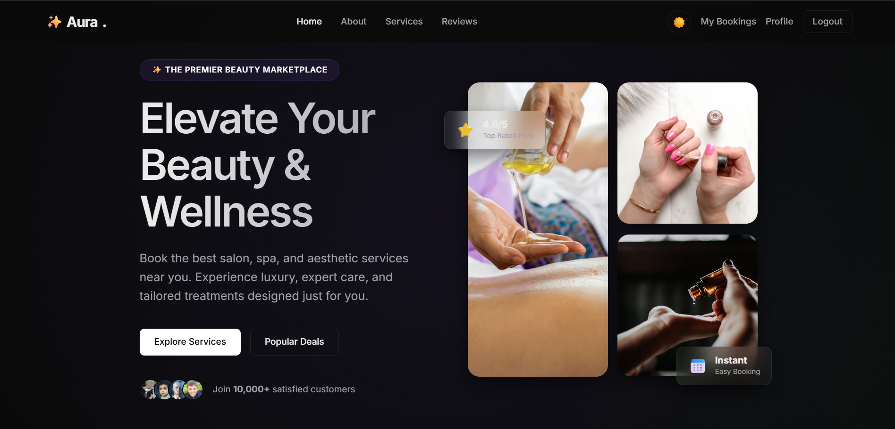

# ✨ Aura | Premium Beauty & Wellness Marketplace


Aura is a high-end, full-stack marketplace designed for premium beauty and wellness services. It features a stunning glassmorphic UI, secure authentication, and a robust booking management system.

 *(Note: Placeholder for your screenshot)*

## 🚀 Features

- **Premium UI/UX**: Modern glassmorphism design with GSAP animations and smooth transitions.
- **Smart Service Discovery**: Browse, filter, and search for various beauty services.
- **Full-Stack Booking**: End-to-end appointment scheduling with real-time database updates.
- **JWT Authentication**: Secure user registration and login system.
- **Admin Dashboard**: Powerful interface to manage bookings, track revenue, and monitor active users.
- **Role-Based Access**: Specialized views for Customers and Administrators.
- **In-Memory Fallback**: Automatically switches to an in-memory MongoDB if a local/cloud connection is unavailable.

## 🛠 Tech Stack

- **Frontend**: HTML5, CSS3 (Vanilla), JavaScript (ES6+), GSAP (Animations).
- **Backend**: Node.js, Express.js.
- **Database**: MongoDB (Atlas Cloud) with Mongoose ODM.
- **Authentication**: JSON Web Tokens (JWT) & Bcrypt.

## 📂 Project Structure

```text
├── frontend/             # Client-side files
│   ├── css/              # Stylesheets
│   ├── js/               # Frontend logic & API helpers
│   ├── admin.html        # Management Dashboard
│   ├── bookings.html     # User's appointment list
│   └── index.html        # Homepage
├── server/               # Backend API
│   ├── config/           # Database configuration
│   ├── controllers/      # Route handlers
│   ├── models/           # Mongoose schemas
│   ├── routes/           # API endpoints
│   └── server.js         # Entry point
└── .gitignore            # Git exclusion rules
```

## ⚙️ Setup & Installation

### 1. Prerequisites
- [Node.js](https://nodejs.org/) installed.
- [MongoDB Atlas](https://www.mongodb.com/cloud/atlas) account (optional, fallback included).

### 2. Backend Setup
```bash
cd server
npm install
```

### 3. Environment Variables
Create a `.env` file in the `server/` directory:
```env
PORT=5000
MONGO_URI=your_mongodb_atlas_uri
JWT_SECRET=your_super_secret_key
```

### 4. Run the Application
```bash
# In the server directory
npm run dev
```

### 5. Access the Project
Open [http://localhost:5000](http://localhost:5000) in your browser. The server now hosts both the frontend and the backend API.

## 🔑 Admin Access
To access the Admin Dashboard:
1. Register with the email `kushagrabajpeimbc@gmail.com` to be automatically granted the **Admin** role.
2. Navigate to the **Admin** link in the navigation bar.

## 📝 License
Distributed under the MIT License.

---
Developed with ✨ by Kushagra Bajpei
```
